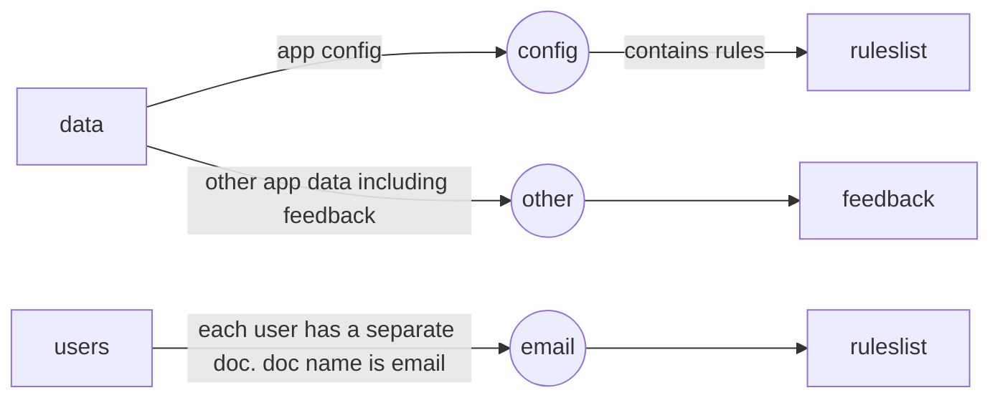

# ARNET Helper
## Let us help you track and maintain U.S Army Reserve Network (ARNET) Access!

Tracking and Maintaining ARNET Access is a pain. This app allows US Army Reserve soldiers maintain their ARNET Access by providing them a way to track the various training requirements

- See all of the training requirements in one place
- User driven - Put in the date you completed a given training and the app will help you track it
- ✨Magic ✨

## Development
Want to contribute? Great! Here's how to setup  your environment (IDE/Workstation):

- [Firebase setup] - Create a new database in Firebase and download the google-services.json file to your /android/app folder
- Run the prepareDB() method in the preapreDB.dart file to populate the initial data in the db
- Setup Firebase Storage (Storage Tab in Firebase console)
- Configure Login with Google and Facebook.
- Enable Auth for Google and FB in Firebase
- Make sure to put in Facebook credentials in Firebase Auth settings

## Data Model
- [Config - Rules](https://postimg.cc/CRxtLvwj)
- [User Data](https://postimg.cc/jwsz61C5)

Legend:
Square = Collection
Circle = Document

## License

MIT

**Open Source Software, Hell Yeah!**

[Firebase Setup]: <https://www.youtube.com/watch?v=Wa0rdbb53I8>
[PlDb]: <https://github.com/joemccann/dillinger/tree/master/plugins/dropbox/README.md>
[PlGh]: <https://github.com/joemccann/dillinger/tree/master/plugins/github/README.md>
[PlGd]: <https://github.com/joemccann/dillinger/tree/master/plugins/googledrive/README.md>
[PlOd]: <https://github.com/joemccann/dillinger/tree/master/plugins/onedrive/README.md>
[PlMe]: <https://github.com/joemccann/dillinger/tree/master/plugins/medium/README.md>
[PlGa]: <https://github.com/RahulHP/dillinger/blob/master/plugins/googleanalytics/README.md>